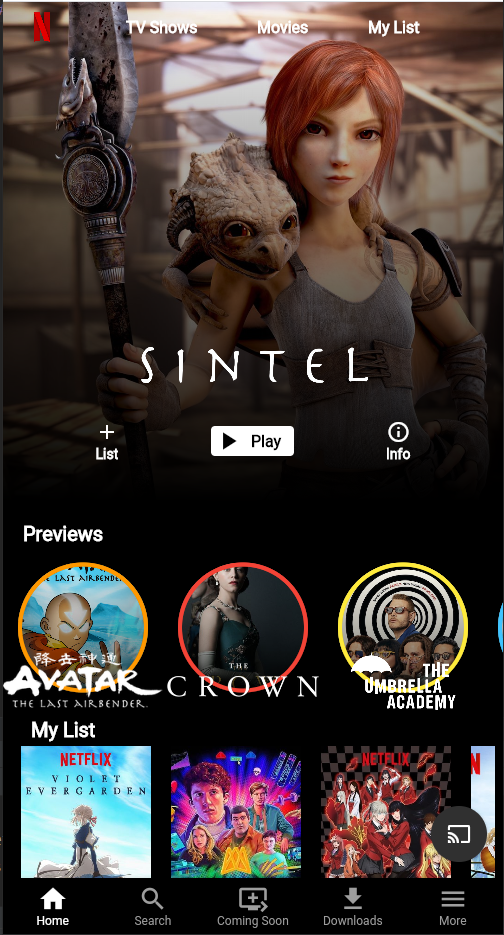
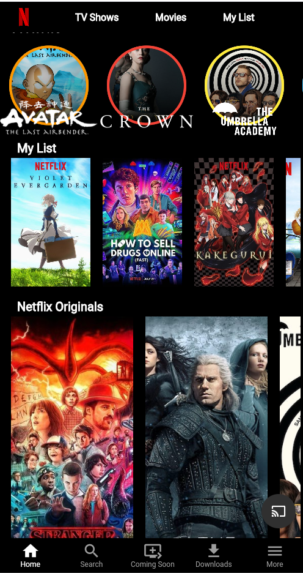
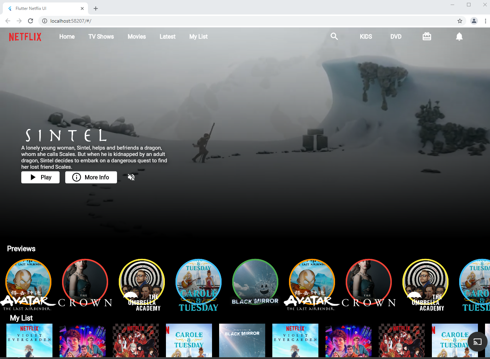

# Flutter Netflix Responsive UI Tutorial | Web and Mobile

#### Following this [tutorial](https://youtu.be/rJKN_880b-M), with the addition of my touch.

### The used Plugins:
* [Flutter Bloc](https://pub.dev/packages/flutter_bloc)
* [Video Player](https://pub.dev/packages/video_player)
* [Responsive Bulider](https://pub.dev/packages/responsive_builder)
* [Pedantic](https://pub.dev/packages/pedantic)